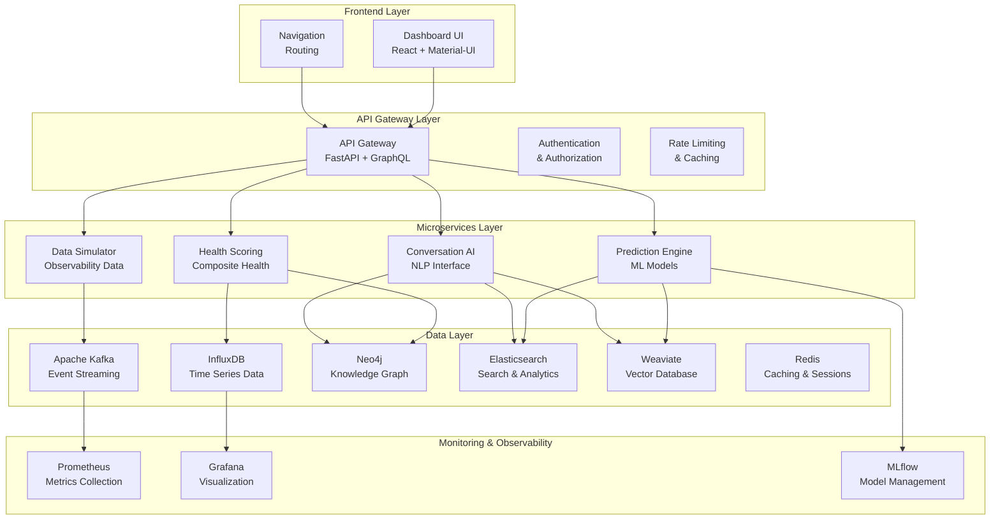
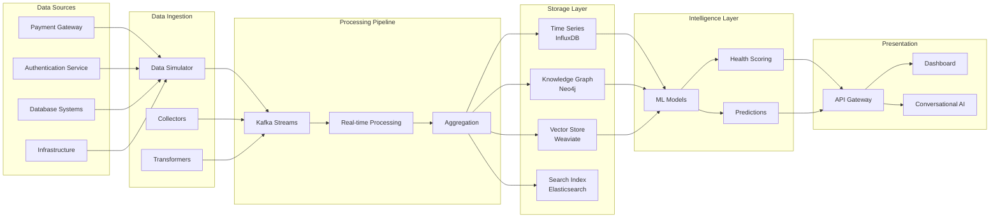
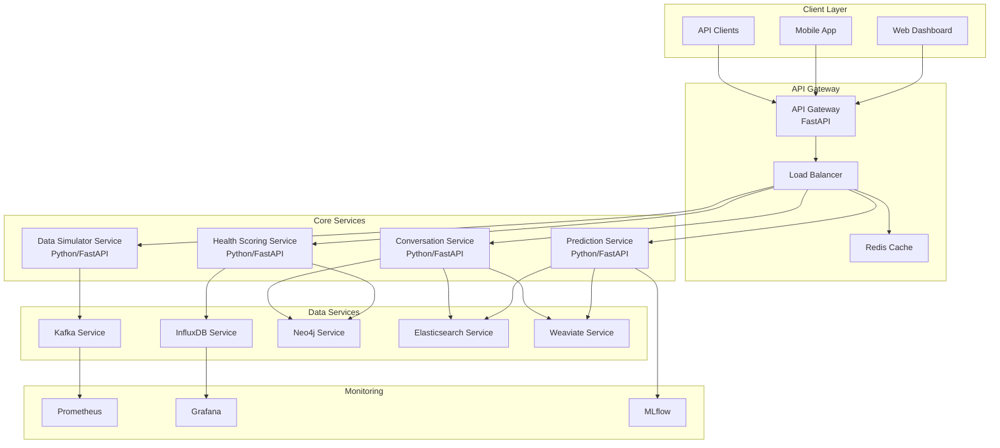
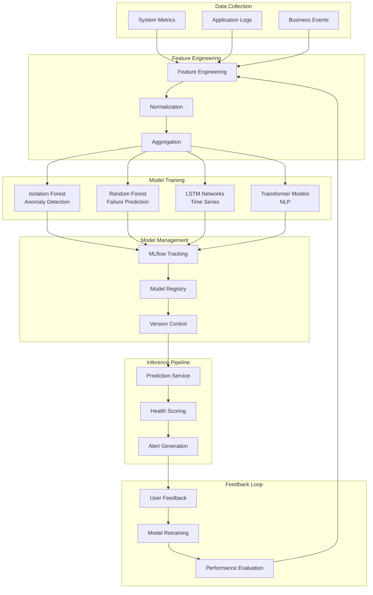
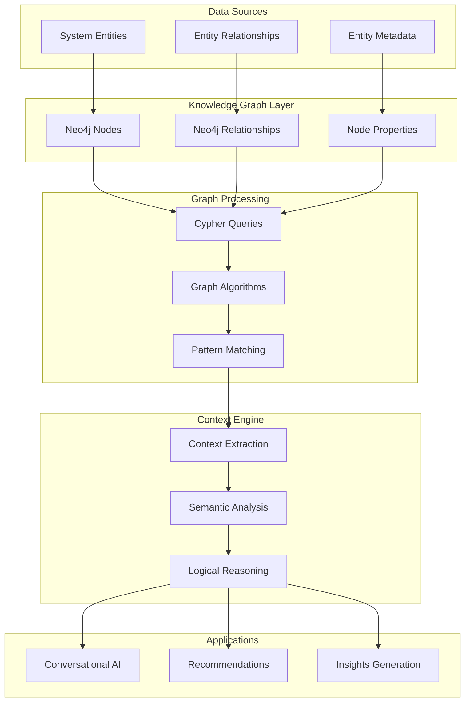
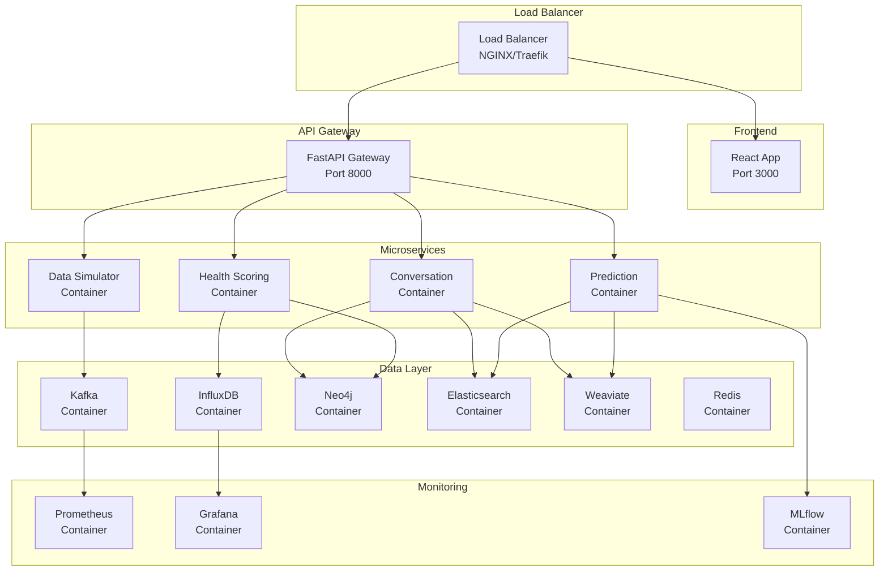
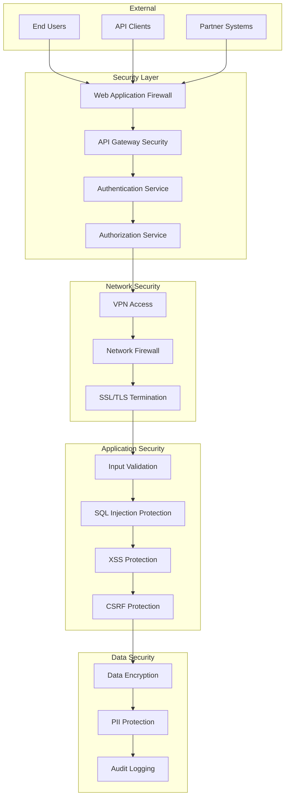
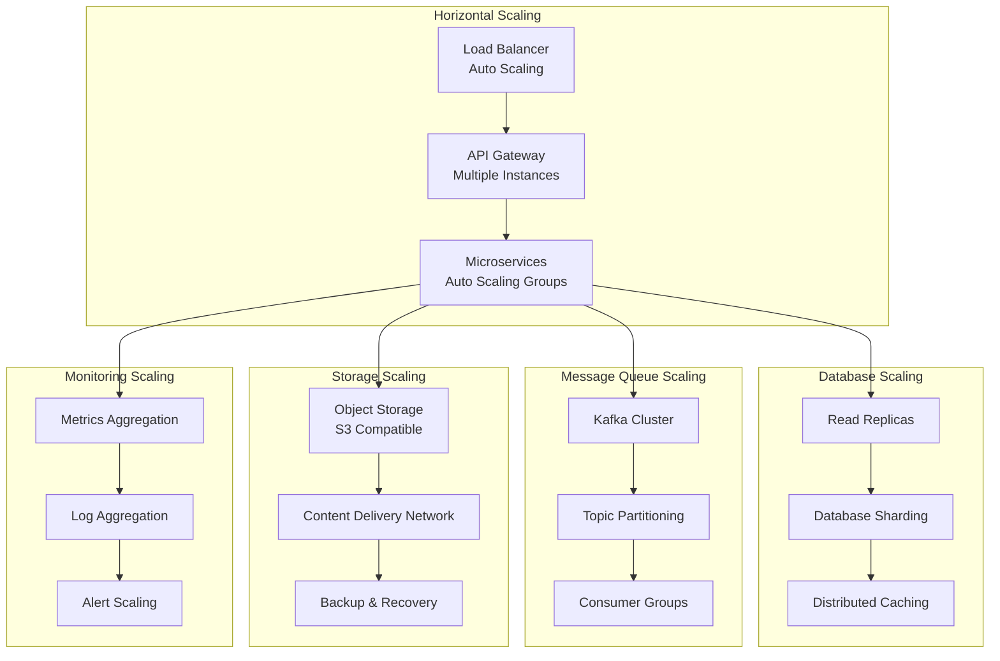

# Predictive System Health Platform - Architecture Diagrams

## 1. High-Level System Architecture

## 2. Data Flow Architecture

## 3. Microservices Architecture

## 4. ML Pipeline Architecture

## 5. Knowledge Graph Architecture

## 6. Deployment Architecture

## 7. Security Architecture

## 8. Scalability Architecture

## Key Architecture Principles

### 1. **Microservices Architecture**
- Independent, loosely coupled services
- Each service has its own database
- Service-to-service communication via APIs
- Independent deployment and scaling

### 2. **Event-Driven Architecture**
- Kafka for event streaming
- Asynchronous processing
- Event sourcing for audit trails
- Real-time data processing

### 3. **Data Architecture**
- Polyglot persistence (different databases for different use cases)
- Time-series data in InfluxDB
- Graph data in Neo4j
- Vector embeddings in Weaviate
- Search in Elasticsearch

### 4. **ML Pipeline**
- Continuous model training and deployment
- A/B testing capabilities
- Model versioning and rollback
- Automated retraining based on feedback

### 5. **Observability**
- Distributed tracing
- Centralized logging
- Metrics collection and alerting
- Performance monitoring

### 6. **Security**
- Zero-trust security model
- API authentication and authorization
- Data encryption at rest and in transit
- Regular security audits

### 7. **Scalability**
- Horizontal scaling capabilities
- Auto-scaling based on demand
- Load balancing and failover
- Geographic distribution

This architecture provides a robust, scalable, and maintainable foundation for the Predictive System Health Platform, enabling real-time monitoring, intelligent predictions, and conversational AI capabilities. 