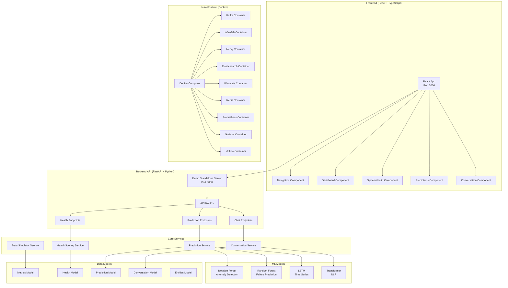
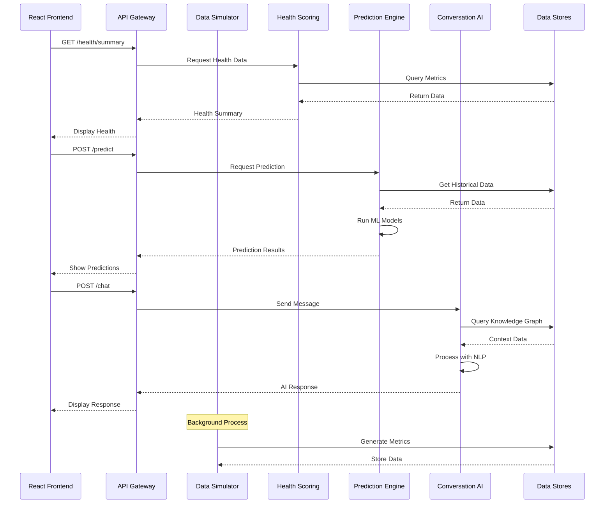
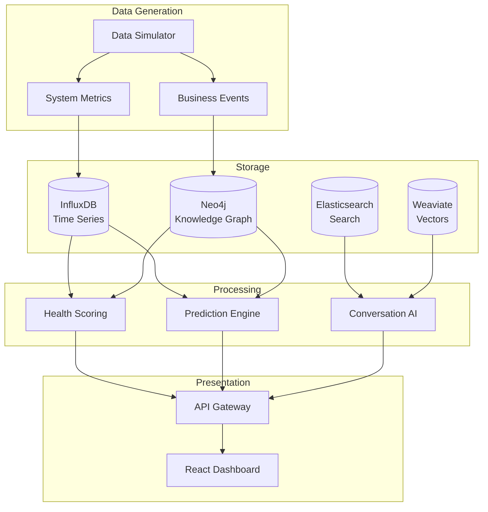
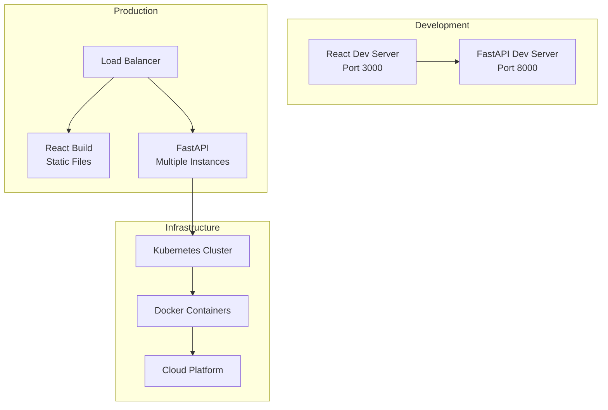
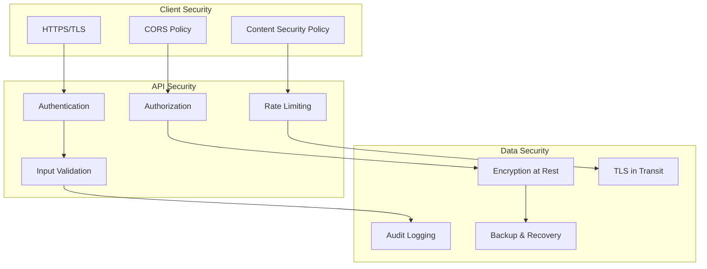

# Predictive System Health Platform - Component Diagram

## Current Implementation Structure



## File Structure Overview

```
pulse/
├── 📁 frontend/                    # React Frontend
│   ├── 📄 package.json            # Dependencies
│   ├── 📁 public/
│   │   └── 📄 index.html          # HTML Template
│   └── 📁 src/
│       ├── 📄 index.tsx           # App Entry Point
│       ├── 📄 App.tsx             # Main App Component
│       ├── 📄 index.css           # Global Styles
│       └── 📁 components/
│           ├── 📄 Navigation.tsx  # Sidebar Navigation
│           ├── 📄 Dashboard.tsx   # Main Dashboard
│           ├── 📄 SystemHealth.tsx # Health View
│           ├── 📄 Predictions.tsx # Predictions View
│           └── 📄 Conversation.tsx # Chat Interface
│
├── 📁 services/                   # Microservices
│   ├── 📁 api_gateway/           # API Gateway Service
│   ├── 📁 conversation/          # Conversational AI
│   ├── 📁 data_simulator/        # Data Generation
│   ├── 📁 health_scoring/        # Health Calculations
│   └── 📁 prediction/            # ML Predictions
│
├── 📁 src/                       # Shared Models
│   └── 📁 models/
│       ├── 📄 conversation.py    # Chat Models
│       ├── 📄 entities.py        # System Entities
│       ├── 📄 health.py          # Health Models
│       ├── 📄 metrics.py         # Metrics Models
│       └── 📄 predictions.py     # Prediction Models
│
├── 📄 demo_standalone.py         # Standalone Demo Server
├── 📄 docker-compose.yml         # Infrastructure
├── 📄 requirements.txt           # Python Dependencies
└── 📄 README.md                  # Documentation
```

## Service Communication Flow



## Data Flow Architecture



## Technology Stack

### Frontend
- **React 18** - UI Framework
- **TypeScript** - Type Safety
- **Material-UI** - Component Library
- **React Router** - Navigation
- **Axios** - HTTP Client

### Backend
- **FastAPI** - API Framework
- **Python 3.13** - Runtime
- **Pydantic** - Data Validation
- **Uvicorn** - ASGI Server

### Machine Learning
- **Scikit-learn** - ML Algorithms
- **NumPy/Pandas** - Data Processing
- **MLflow** - Model Management
- **OpenAI** - NLP Models

### Data Storage
- **InfluxDB** - Time Series Data
- **Neo4j** - Knowledge Graph
- **Elasticsearch** - Search & Analytics
- **Weaviate** - Vector Database
- **Redis** - Caching

### Infrastructure
- **Docker** - Containerization
- **Docker Compose** - Orchestration
- **Kafka** - Event Streaming
- **Prometheus** - Metrics
- **Grafana** - Visualization

## Deployment Architecture



## Security Architecture



This component diagram provides a comprehensive view of the current implementation, showing how all the pieces fit together in the Predictive System Health Platform. 